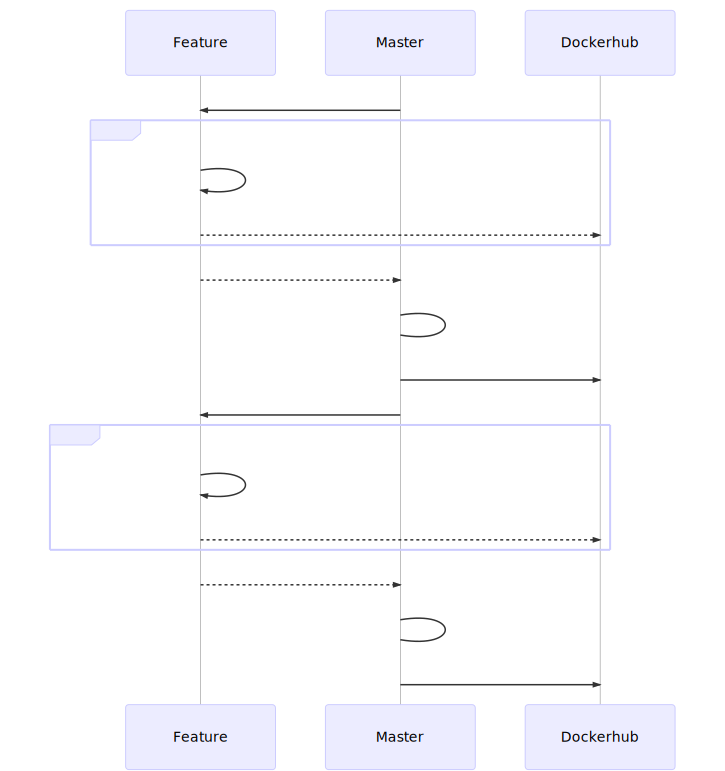

# Travis CI

The Travis continuous integration tool is used.

## Travis configuration

The following Environment variables shall be set up to allow automatic deployment to Dockerhub.

```console
DOCKER_REGISTRY # this variable shall be set to your personal Dockerhub registry (typically equals username)
DOCKER_USERNAME = %your username%
DOCKER_PASSWORD = %your password%
```

> **Note:** On the main Travis CI the DOCKER_REGISTRY variable is set to **itisfoundation**. All the built docker images are then deployed to itisfoundation/%imageName%.

## Release workflow



> **Note:** The terms *repository* and *registry* above refer to VCS repository at github and docker images registry at dockerhub, resp.
