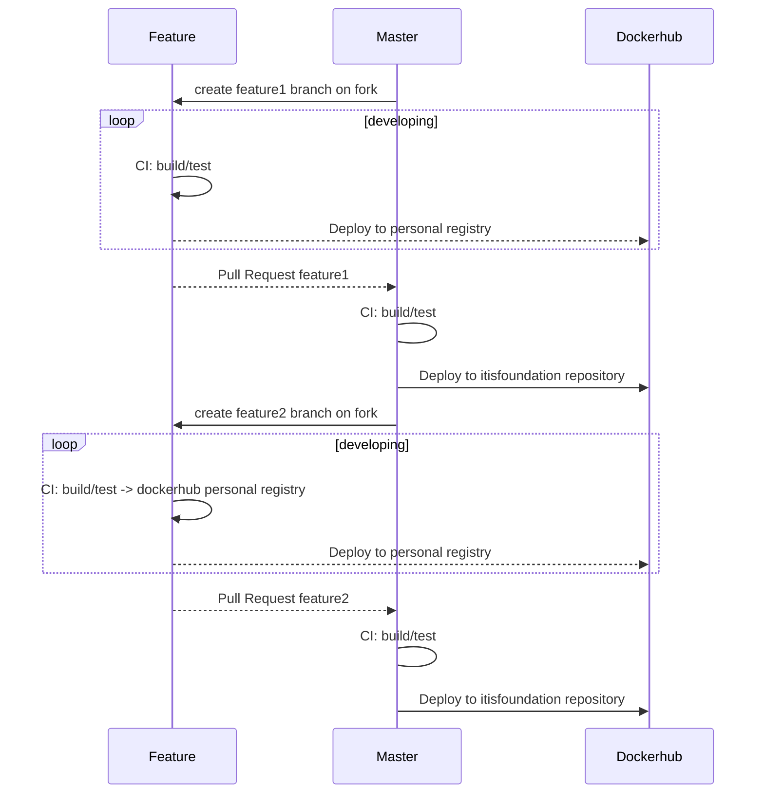

# Travis CI

The Travis continuous integration tool is used.

## Release workflow

```mermaid
sequenceDiagram
participant Feature
participant Master
participant Dockerhub

Master->>Feature: create feature1 branch on fork
loop developing
    Feature->>Feature: CI: build/test
    Feature-->>Dockerhub: Deploy to personal registry
end
Feature-->>Master: Pull Request feature1
Master->Master: CI: build/test
Master->>Dockerhub: Deploy to itisfoundation repository

Master->>Feature: create feature2 branch on fork
loop developing
    Feature->>Feature: CI: build/test -> dockerhub personal registry
    Feature-->>Dockerhub: Deploy to personal registry
end
Feature-->>Master: Pull Request feature2
Master->Master: CI: build/test
Master->>Dockerhub: Deploy to itisfoundation repository
```
